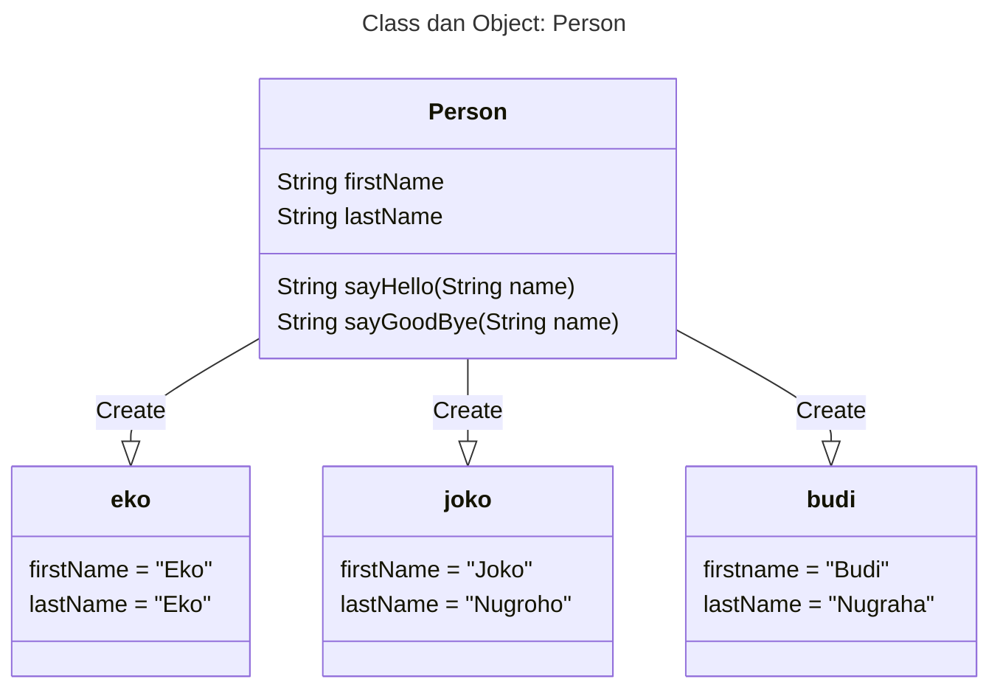
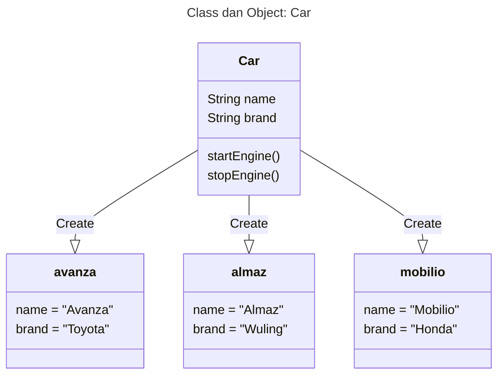

# TypeScript Object Oriented Programming

## Pengenalan Object Oriented Programming

### Apa itu Object Oriented Programming ? 
* Object Oriented Programming adalah sudut pandang bahasa pemrograman yang berkonsep 'object'.
* Ada banyak sudut pandang bahasa pemrograman, namun OOP adalah yang sangat populer saat ini.
* Ada beberapa istilah yang perlu dimengerti dalam OOP, yaitu: Object dan Class.

#### Apa itu Object ?
* Object adalah data yang berisi field / properties / attributes dan method / function / behavior.

#### Apa itu Class ?
* Class adalah blueprint, prototype atau cetakan untuk membuat object.
* Class berisikan deklarasi semua properties dan functions yang dimiliki oleh object.
* Setiap object selalu di buat dari class.
* Dan sebuah class bisa membuat object tanpa batas.





## OOP di TypeScript
* Implementasi OOP di TypeScript, sebenarnya akan diterjemahkan menjadi kode JavaScript.
* Dan JavaScript sendiri sebenarnya sejak awal dibuat sebagai bahasa prosedural, bukan bahasa pemrograman berorientasi objek.
* Oleh karena itu, implementasi OOP di JavaScript memang tidak sedetail bahasa pemrograman lain yang memang dari awal merupakan bahasa pemrograman OOP seperti Java atau C++.

## Membuat Project
* Buat folder typescript-object-oriented-programming.
* ``` npm init ```
* Buka package.json, dan tambah type module.

## Menambah Library Jest untuk Unit Test
* ``` npm install --save-dev jest @types/jest ```
* [https://www.npmjs.com/package/jest](https://www.npmjs.com/package/jest)

## Menambah Library Babel
* ``` npm install --save-dev babel-jest @babel/preset-env ```
* [https://babeljs.io/setup#installation](https://babeljs.io/setup#installation)

## Menambah TypeScript
* ``` npm install --save-dev typescript ```
* [https://www.npmjs.com/package/typescript](https://www.npmjs.com/package/typescript)

## Setup TypeScript Project
* ``` npx tsc --init ```
* Semua konfigurasi akan dibuat di file tsconfig.json
* Ubah ``` "module" ``` dari ``` "commonjs" ``` menjadi ``` "ES6" ```.

## Setup TypeScript untuk Jest
* [https://jestjs.io/docs/getting-started#using-typescript](https://jestjs.io/docs/getting-started#using-typescript)